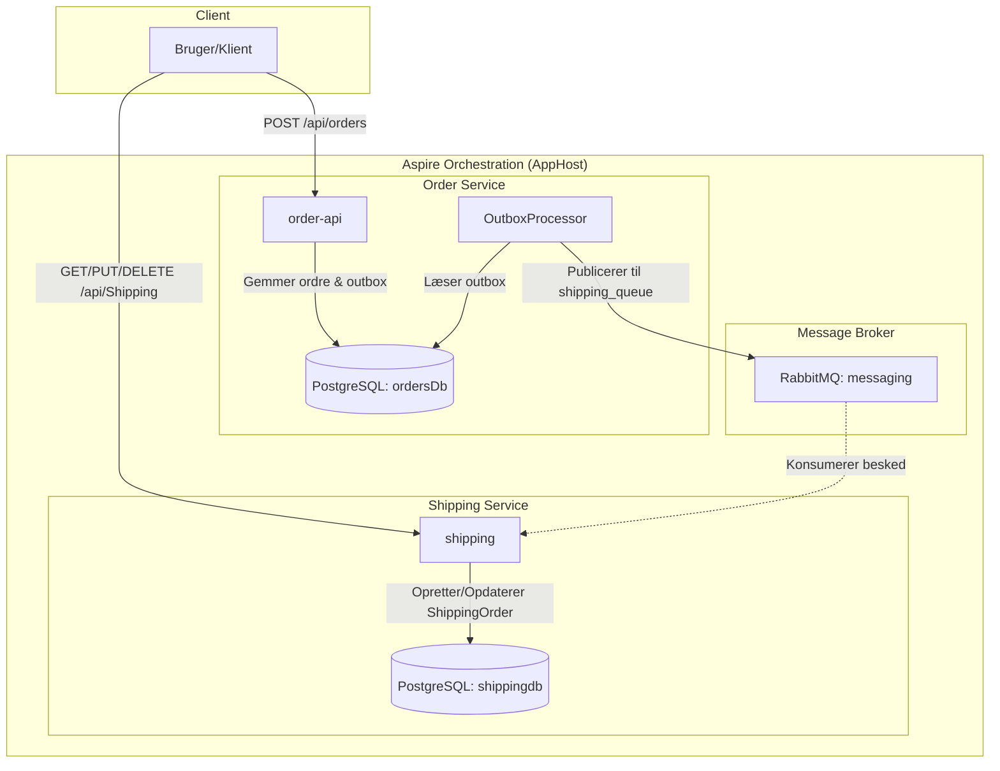

# SystemIntegration10 - Arkitekturbeskrivelse

Dette projekt er en distribueret løsning bygget med **.NET 10** og **.NET Aspire**, der demonstrerer integration mellem mikroservices ved brug af asynkron beskedudveksling via **RabbitMQ** og datalagring i **PostgreSQL**.

## Arkitekturoversigt

Løsningen består af to primære API-services, der kommunikerer asynkront:

1.  **Order.Api**: Ansvarlig for håndtering af ordrer. Når en ordre oprettes, gemmes den i sin egen database sammen med en outbox-besked. En baggrundsservice (**OutboxProcessor**) læser derefter disse beskeder og sender dem til RabbitMQ, hvilket sikrer pålidelig levering (Transactional Outbox pattern).
2.  **shipping** (Shipping.Api): Ansvarlig for forsendelse. Den lytter på RabbitMQ-køen (`shipping_queue`) og opretter en forsendelsesordre i sin egen database, når en ny ordre-besked modtages. Den udstiller desuden et REST API (`/api/Shipping`) til overvågning og opdatering af forsendelsesstatus.
3.  **RabbitMQ**: Fungerer som message broker, der sikrer løs kobling (loose coupling) mellem de to services.
4.  **PostgreSQL**: Anvendes som persistent lagring med separate databaser for hver service (`ordersDb` til ordrer og `shippingdb` til forsendelse).
5.  **AppHost**: Fungerer som orkestrator (Aspire), der forbinder alle dele og håndterer infrastruktur som containere og konfiguration.

## Systemdiagram

## Kom i gang
1. Sørg for at have Docker Desktop eller lignende kørende.
2. Kør `SystemIntegration10.AppHost` projektet.
3. Brug Aspire Dashboardet. I kan tilgå scalar webinterfacet for begge webapi'er
4. I kan tilgå Postgres databaserne via pgweb admin værktøjet.

### Opgave: Implementer Idempotent Receiver
I et distribueret system kan beskeder blive leveret mere end én gang (at-least-once delivery). Dette kan ske pga. netværksfejl, retries i RabbitMQ eller hvis en service crasher lige efter at have behandlet en besked, men før den sender ACK.

**Formål:** Sørg for at `Shipping.Api` ikke opretter flere forsendelsesordrer for den samme oprindelige ordre, hvis den modtager den samme besked to gange.

1.  Gå til `Shipping.Api/Services/ShippingMessageReceiver.cs`.
2.  Kør tests og verificer at de fejler med at der er to ShippingOrders oprettet for den samme OrderId.
3.  Implementer et tjek mod `ShippingContext.ShippingOrders` databasen for at se om en ordre med det pågældende `OrderId` allerede er oprettet.
4.  Hvis den findes, skal du logge en advarsel og springe over oprettelsen.
5.  **Bonus:** Forbedr pålideligheden ved at deaktivere `autoAck` og i stedet sende et eksplicit ACK til RabbitMQ kun når beskeden er færdigbehandlet og gemt i databasen.

## Teknologier
- **Framework:** .NET 10
- **Orkestrering:** .NET Aspire
- **Beskedkø:** RabbitMQ (via Aspire RabbitMQ Client)
- **Database:** PostgreSQL (via Aspire Npgsql EntityFrameworkCore)
- **API:** ASP.NET Core Controllers

